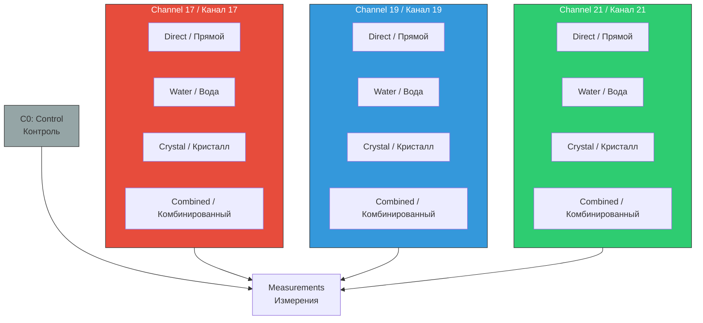
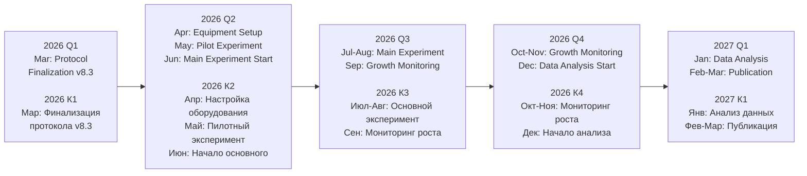
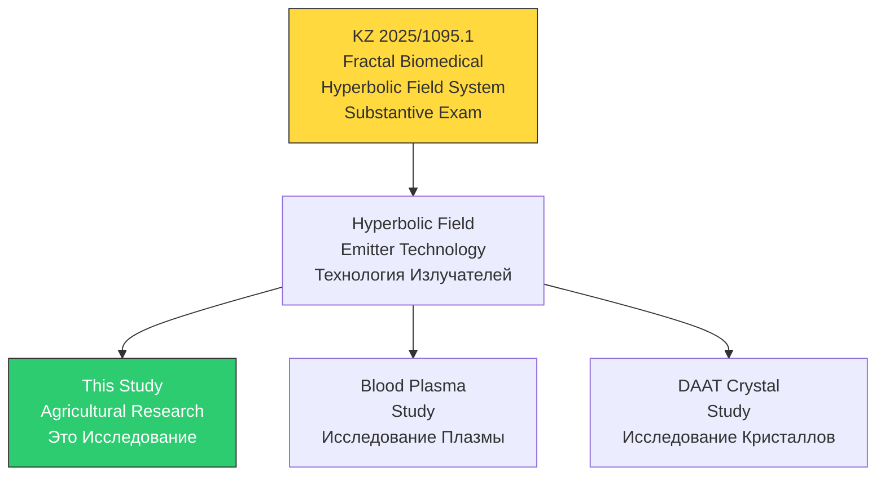

# Hyperbolic Field Agricultural Study / Исследование Влияния Гиперболических Полей на Сельское Хозяйство

<div align="center">

**Seed Germination, Plant Growth & Agricultural Yield Under Hyperbolic Field Exposure**

**Прорастание Семян, Рост Растений и Урожайность Под Воздействием Гиперболических Полей**

[](https://github.com/AdvancedScientificResearchProjects)
[]()
[]()

**Part of Advanced Scientific Research Projects (ASRP) Ecosystem**

**Часть Экосистемы ASRP**

</div>

---

## QUICK NAVIGATION / БЫСТРАЯ НАВИГАЦИЯ

| Section / Раздел | Description / Описание | Status / Статус |
|------------------|----------------------|-----------------|
| [Overview / Обзор](#overview--обзор) | Study objectives / Цели исследования |  Defined |
| [Research Goals / Цели](#research-goals--цели-исследования) | 7 measurable goals / 7 измеримых целей |  Defined |
| [Experimental Design / Дизайн](#experimental-design--экспериментальный-дизайн) | 13 groups, 6 crops, 8 substrates / 13 групп, 6 культур, 8 субстратов |  Protocol v8.3 |
| [Treatment Groups / Группы](#treatment-groups--группы-обработки) | Direct, Water, Crystal, Combined / Прямой, Вода, Кристалл, Комбинированный |  Defined |
| [Timeline / Сроки](#timeline--временная-шкала) | ~7 months, 7 phases / ~7 месяцев, 7 фаз |  Planned |
| [Team / Команда](#research-team--команда) | 7 researchers + collaborator / 7 исследователей + коллаборант |  Assigned |
| [Active Issues / Задачи](#active-issues--tasks--активные-задачи) | GitHub Issues / Задачи GitHub |  7 Open |
| [Patent Connection / Патент](#patent-connection--связь-с-патентом) | KZ 2025/1095.1 |  Substantive Exam |

---

## OVERVIEW / ОБЗОР

### EN

Randomized controlled trial (RCT) investigating the effects of hyperbolic field exposure on seed germination, plant growth dynamics, and agricultural yield. The study includes direct exposure, water-mediated effects, and crystal-based treatment across 6 crop varieties and 8 soil substrates, including Mars and Moon regolith simulants for space agriculture applications.

### RU

Рандомизированное контролируемое испытание (РКИ) по исследованию воздействия гиперболических полей на прорастание семян, динамику роста растений и сельскохозяйственную урожайность. Исследование включает прямое воздействие, эффекты через воду и кристаллы на 6 видах культур и 8 почвенных субстратах, включая симулянты марсианского и лунного реголита для космического земледелия.

---

## KEY METRICS / КЛЮЧЕВЫЕ МЕТРИКИ

| Parameter / Параметр | Value / Значение |
|---------------------|-----------------|
| **Study Type / Тип исследования** | Randomized Controlled Trial (RCT) / Рандомизированное контролируемое испытание |
| **Protocol Version / Версия протокола** | v8.3 (March 2026) |
| **Duration / Длительность** | 196–226 days (~7 months) / 196–226 дней (~7 месяцев) |
| **Treatment Groups / Группы** | 13 (1 control + 12 treatment) / 13 (1 контроль + 12 обработка) |
| **Crops / Культуры** | 6 |
| **Seeds per Group / Семян на группу** | 200 |
| **Total Seeds / Всего семян** | 15,600 |
| **Substrates / Субстраты** | 8 (including Mars/Moon regolith simulants) |
| **Channels / Каналы** | 17, 19, 21 (+ Channel 14 mutagenic) |
| **Statistical Power** | d=0.5, α=0.05, power=0.80, N=200/group |
| **Patent / Патент** | KZ 2025/1095.1 |

---

## RESEARCH GOALS / ЦЕЛИ ИССЛЕДОВАНИЯ

| Goal / Цель | Target / Показатель | Expected Effect / Ожидаемый Эффект |
|-------------|--------------------|------------------------------------|
| **G1** Germination Acceleration / Ускорение прорастания | T50 (time to 50% germination) | -20–40% reduction / Сокращение на 20–40% |
| **G2** Germination Rate / Показатель всхожести | Germination percentage | +10–20% increase / Увеличение на 10–20% |
| **G3** Growth Rate / Скорость роста | Plant height, biomass | +15–30% increase / Увеличение на 15–30% |
| **G4** Stress Resilience / Стресс-устойчивость | Survival in poor substrates | >80% in regolith / >80% в реголите |
| **G5** Yield Optimization / Оптимизация урожая | Seed yield per plant | +10–25% increase / Увеличение на 10–25% |
| **G6** Water Treatment / Обработка воды | Treated water effects | Measurable growth difference / Измеримая разница |
| **G7** Crystal Treatment / Обработка кристаллами | Passive field effects | Validate crystal efficacy / Валидация кристаллов |

---

## EXPERIMENTAL DESIGN / ЭКСПЕРИМЕНТАЛЬНЫЙ ДИЗАЙН

### Treatment Groups / Группы Обработки



> **Channel 14 (Mutagenic / Мутагенный):** Separate investigation of mutagenic effects on seed germination — must be included in hypotheses / Отдельное исследование мутагенных эффектов на прорастание семян — должен быть включён в гипотезы

### Channel 14: Mutagenesis Hypothesis / Канал 14: Гипотеза Мутагенности

**EN:** Hyperbolic radiation on channel 14 presumably induces mutagenesis in plants -- analogous to classical gamma irradiation, but through a hyperbolic field. The goal is to obtain new plant varieties with novel properties. In the classical approach, a large sample (thousands of seeds) is irradiated with gamma radiation, then mutations are analyzed. We use hyperbolic radiation instead of gamma. Possible channel combinations: 14, 14+17, 14+19.

**RU:** Гиперболическое излучение на 14-м канале предположительно вызывает мутагенность в растениях -- аналогично классическому гамма-облучению, но через гиперболическое поле. Цель -- получение растений новых видов с новыми свойствами. В классическом подходе берётся большая выборка (тысячи семян), облучается гамма-излучением, затем анализируются мутации. Мы используем гиперболическое излучение вместо гамма. Возможные комбинации каналов: 14, 14+17, 14+19.

### Soil Substrate Matrix / Матрица Почвенных Субстратов

| Code | Substrate / Субстрат | Purpose / Назначение |
|------|---------------------|---------------------|
| **S0** | Germination base / Основа прорастания | Baseline / Базовая линия |
| **S1** | Nutrient gauze / Питательная марля | Hydroponic / Гидропоника |
| **S2** | Poor soil / Бедная почва | Stress test / Стресс-тест |
| **S3** | Medium soil / Средняя почва | Standard / Стандарт |
| **S4** | Rich soil / Богатая почва | Optimal / Оптимум |
| **S5** | Stony soil / Каменистая почва | Stress test / Стресс-тест |
| **S6** | Mars regolith simulant (JSC Mars-1) / Симулянт марсианского реголита | Space agriculture / Космическое земледелие |
| **S7** | Moon regolith simulant (LMS-1) / Симулянт лунного реголита | Space agriculture / Космическое земледелие |

### Water Treatment Protocol / Протокол Обработки Воды

| Parameter / Параметр | Value / Значение |
|---------------------|-----------------|
| **Water Type / Тип воды** | Distilled / Дистиллированная |
| **Volume / Объём** | 5L per treatment / 5 л на обработку |
| **Container / Ёмкость** | Glass beaker / Стеклянный стакан |
| **Distance from Emitter / Расстояние** | 10 cm / 10 см |
| **Exposure Time / Время воздействия** | 60 min / 60 мин |
| **Channels / Каналы** | 17, 19, 21 |
| **Temperature / Температура** | 20–22°C |
| **Usage Window / Окно использования** | Within 24h / В течение 24ч |

---

## TIMELINE / ВРЕМЕННАЯ ШКАЛА



---

## MEASUREMENTS / ИЗМЕРЕНИЯ

| Category / Категория | Parameters / Параметры |
|---------------------|----------------------|
| **Primary / Основные** | Germination time (T50), germination percentage, germination uniformity / Время прорастания (T50), процент всхожести, однородность |
| **Secondary / Вторичные** | Plant height, leaf count, stem diameter, chlorophyll (SPAD), fresh/dry biomass, seed yield / Высота, число листьев, диаметр стебля, хлорофилл (SPAD), свежая/сухая биомасса, урожай |

### Statistical Analysis / Статистический Анализ

| Method / Метод | Application / Применение |
|---------------|-------------------------|
| **ANOVA + Tukey HSD** | Group comparisons / Сравнение групп |
| **Chi-square** | Germination rate / Процент всхожести |
| **Mixed-effects models** | Repeated measures / Повторные измерения |
| **ANCOVA** | Covariate adjustment / Корректировка ковариат |
| **TOST Equivalence** | Equivalence testing / Тест эквивалентности |
| **Factorial ANOVA** | Interaction effects / Эффекты взаимодействия |

**Software:** R

---

## DATA STRUCTURE / СТРУКТУРА ДАННЫХ

```
Hyperbolic_Field_Agricultural_Study/
|
|-- README.md
|
|-- data/
|   |-- control/                       # Control group C0 / Контрольная группа
|   |   `-- photos/
|   |-- ch17-direct/                   # Channel 17 direct exposure / Прямое воздействие
|   |   `-- photos/
|   |-- ch17-water/                    # Channel 17 water treatment / Через воду
|   |   `-- photos/
|   |-- ch17-crystal/                  # Channel 17 crystal treatment / Через кристалл
|   |   `-- photos/
|   |-- ch17-combined/                 # Channel 17 combined / Комбинированный
|   |   `-- photos/
|   |-- ch19-direct/                   # Channel 19 direct / Прямое
|   |   `-- photos/
|   |-- ch19-water/
|   |   `-- photos/
|   |-- ch19-crystal/
|   |   `-- photos/
|   |-- ch19-combined/
|   |   `-- photos/
|   |-- ch21-direct/                   # Channel 21 direct / Прямое
|   |   `-- photos/
|   |-- ch21-water/
|   |   `-- photos/
|   |-- ch21-crystal/
|   |   `-- photos/
|   `-- ch21-combined/
|       `-- photos/
|
|-- charts/                            # Analysis charts / Графики
|-- protocols/                         # Experiment protocols / Протоколы
|-- reports/                           # Analysis reports / Отчёты
`-- scripts/                           # Analysis scripts (R) / Скрипты (R)
```

---

## PATENT CONNECTION / СВЯЗЬ С ПАТЕНТОМ



---

## RESEARCH TEAM / КОМАНДА

| Name / ФИО | Role / Роль | Responsibilities / Обязанности |
|-----------|------------|-------------------------------|
| **Valeria Ovsyannikova / Валерия Овсянникова** | Director of Biomedical Research Department / Директор департамента биомедицинских исследований | Research coordination, protocol design / Координация, дизайн протокола |
| **Ivan Savelyev / Иван Савельев** | Science Director & Editor-in-Chief of ASRP.science / Директор по науке и главный редактор научного журнала ASRP.science | Scientific direction / Научное направление |
| **Mykhailo Kapustin / Михайло Капустин** | CTO & Director of AI and IT Department / Технический директор и директор департамента ИИ и ИТ | IT infrastructure / ИТ-инфраструктура |
| **Kyryl Zmiienko / Кирилл Змиенко** | Chief AI Engineer / Главный ИИ-инженер | AI/ML analysis / ИИ/МО анализ |
| **Alexandr Ovsyannikov / Александр Овсянников** | Head Hardware Engineer / Главный Инженер по Аппаратному Обеспечению | Electrical systems / Электрические системы |
| **Denis Banchenko / Денис Банченко** | Program Director, Author of Research Methodology & Technology / Директор программы, автор методологии и технологии исследования | Project management, hyperbolic field physics / Управление проектом, физика полей |
| **Olesya Chirkova / Олеся Чиркова** | Consultant / Консультант | Blood plasma methodology / Методология плазмы крови |

**Collaborator / Коллаборант:** SASU Point Rouge, France (Chirkova)

---

## ACTIVE ISSUES & TASKS / АКТИВНЫЕ ЗАДАЧИ

| # | Title / Название | Priority / Приоритет | Due / Срок | Status / Статус |
|---|-----------------|---------------------|-----------|-----------------|
| [#1](https://github.com/AdvancedScientificResearchProjects/Hyperbolic_Field_Agricultural_Study/issues/1) | Research Protocol v8.3 / Протокол исследования | — | — |  Complete |
| [#3](https://github.com/AdvancedScientificResearchProjects/Hyperbolic_Field_Agricultural_Study/issues/3) | Agricultural Protocol / Протокол | — | — |  Complete |
| [#4](https://github.com/AdvancedScientificResearchProjects/Hyperbolic_Field_Agricultural_Study/issues/4) | Seed Germination Phase (15 days) / Фаза прорастания |  High | Q2 2026 |  Open |
| [#5](https://github.com/AdvancedScientificResearchProjects/Hyperbolic_Field_Agricultural_Study/issues/5) | Plant Growth Phase (60-90 days) / Фаза роста |  High | Q2-Q3 2026 |  Open |
| [#6](https://github.com/AdvancedScientificResearchProjects/Hyperbolic_Field_Agricultural_Study/issues/6) | Stress Resilience Testing / Стресс-тест |  Medium | Q3 2026 |  Open |
| [#7](https://github.com/AdvancedScientificResearchProjects/Hyperbolic_Field_Agricultural_Study/issues/7) | Water Treatment Analysis / Анализ обработки воды |  Medium | Q3 2026 |  Open |
| [#8](https://github.com/AdvancedScientificResearchProjects/Hyperbolic_Field_Agricultural_Study/issues/8) | Crystal Treatment Validation / Валидация кристаллов |  Medium | Q3 2026 |  Open |

---

## SPACE AGRICULTURE CONTEXT / КОНТЕКСТ КОСМИЧЕСКОГО ЗЕМЛЕДЕЛИЯ

| Program / Программа | Organization / Организация | Year / Год | Achievement / Достижение |
|---------------------|--------------------------|-----------|-------------------------|
| **NASA Veggie** | NASA | 2014+ | ISS plant growth / Выращивание на МКС |
| **APH** | NASA | 2017+ | Advanced Plant Habitat / Продвинутая среда |
| **Chang'e-4** | CNSA | 2019 | First plant on Moon / Первое растение на Луне |
| **Lunar Palace 1** | BHU | 2014-2018 | 370-day closed ecosystem / 370-дневная закрытая система |
| **MELiSSA** | ESA | 1989+ | Life support system / Система жизнеобеспечения |
| **EDEN-ISS** | DLR | 2018+ | Antarctica greenhouse / Теплица в Антарктике |
| **BIOS-3** | USSR | 1965-1984 | Closed ecosystem / Замкнутая экосистема |

---

## ASRP ECOSYSTEM / ЭКОСИСТЕМА ASRP

<div align="center">

### Related Research Repositories / Связанные Исследовательские Репозитории

</div>

| Repository / Репозиторий | Direction / Направление | Link / Ссылка |
|-------------------------|------------------------|---------------|
| **Hyperbolic Field Blood Plasma Study** | Blood plasma coagulation / Свёртываемость плазмы | [View / Просмотр](https://github.com/AdvancedScientificResearchProjects/Hyperbolic_Field_BloodPlasma_Study) |
| **Hyperbolic Field DAAT Crystal Study** | Crystal-human interaction / Взаимодействие кристалл-человек | [View / Просмотр](https://github.com/AdvancedScientificResearchProjects/Hyperbolic_Field_DAAT_Crystal_Study) |
| **Hyperbolic Field Saccharomyces Study** | Yeast fermentation / Ферментация дрожжей | [View / Просмотр](https://github.com/AdvancedScientificResearchProjects/Hyperbolic_Field_SaccharomycesCerevisiae_Study) |
| **ASRP.art** | Art & consciousness / Искусство и сознание | [View / Просмотр](https://github.com/AdvancedScientificResearchProjects/Axionetic_Sensing_Reactions_Platform_in_Art) |
| **UAP Reverse Engineering** | UAP analysis / Анализ НЛО | [View / Просмотр](https://github.com/AdvancedScientificResearchProjects/UAP_Reverse_Engineering_Study) |
| **PLFM RADAR** | Phased array radar / Фазированная антенная решётка | [View / Просмотр](https://github.com/AdvancedScientificResearchProjects/PLFM_RADAR) |

<div align="center">

### Patent Portfolio / Патентный Портфель

</div>

| Patent / Патент | Application / Заявка | Link / Ссылка |
|----------------|---------------------|---------------|
| **Fractal Biomedical System** | KZ 2025/1095.1 | [View / Просмотр](https://github.com/denisbanchenko/Kazpatent_Fractal_Biomedical_System_Patent) |
| **ASRP.art** | KZ 2025/0592.1 + PCT | [View / Просмотр](https://github.com/denisbanchenko/Kazpatent_Axionetic_Sensing_Reactions_Platform_in_Art_Patent) |
| **ASRP.drift** | KZ 413554 | [View / Просмотр](https://github.com/denisbanchenko/Kazpatent_Advanced_Synchro_Resonance_Platform_For_Deep_Resonant_Patent) |
| **GFS** | KZ 2025/1096.1 | [View / Просмотр](https://github.com/denisbanchenko/Kazpatent_Global_Forecasting_System_Patent) |

---

## OSF PREREGISTRATION / ПРЕДВАРИТЕЛЬНАЯ РЕГИСТРАЦИЯ OSF

| Field / Поле | Value / Значение |
|--------------|------------------|
| **Status / Статус** | Registration pending / Регистрация ожидается |
| **Platform / Платформа** | [OSF.io](https://osf.io) |

---

## CONTACT INFORMATION / КОНТАКТНАЯ ИНФОРМАЦИЯ

| Field / Поле | Value / Значение |
|--------------|------------------|
| **Organization / Организация** | ТОО "Перспективные Научно-Исследовательские Разработки" / Advanced Scientific Research Projects LLP |
| **Address / Адрес** | Komarova St. 37, Apt 56, Baikonur, 468320 / Ул. Комарова 37, кв. 56, г. Байконур, 468320 |
| **Country / Страна** | Republic of Kazakhstan / Республика Казахстан |
| **Website / Веб-сайт** | [asrp.tech](https://asrp.tech) |
| **Email** | info@asrp.tech |

---

<div align="center">

**Last Updated / Последнее обновление:** April 2026

**Status / Статус:** Protocol Complete, Equipment Setup Pending / Протокол готов, подготовка оборудования

</div>

---

## TBD

- Seed photos BEFORE/DURING/AFTER exposure / Фото семян ДО/ВО ВРЕМЯ/ПОСЛЕ воздействия
- OSF preregistration link / Ссылка OSF
- Equipment setup photos / Фото установки оборудования

---

## NAVIGATION INDEX / НАВИГАЦИОННЫЙ ИНДЕКС

[Overview / Обзор](#overview--обзор) · [Key Metrics / Метрики](#key-metrics--ключевые-метрики) · [Research Goals / Цели](#research-goals--цели-исследования) · [Experimental Design / Дизайн](#experimental-design--экспериментальный-дизайн) · [Timeline / Сроки](#timeline--временная-шкала) · [Measurements / Измерения](#measurements--измерения) · [Patent Connection / Патент](#patent-connection--связь-с-патентом) · [Team / Команда](#research-team--команда) · [Active Issues / Задачи](#active-issues--tasks--активные-задачи) · [Space Agriculture / Космос](#space-agriculture-context--контекст-космического-земледелия) · [ASRP Ecosystem / Экосистема](#asrp-ecosystem--экосистема-asrp) · [Contact / Контакты](#contact-information--контактная-информация)
